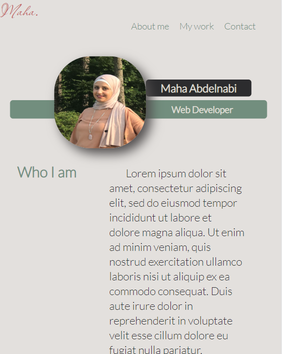

# myPortfolio
##Descripton
this is a brief Portfolio project as a bootcamp student.
it's a deployed webpage applying HTML and advanced CSS properties such as media queries, flexbox and variables.

##installation
[font-1-Passion conflict](https://fonts.googleapis.com/css2?family=Archivo+Narrow&family=Passions+Conflict&display=swap)
[font-2-Archivo](https://fonts.googleapis.com/css2?family=Archivo+Narrow&display=swap)
[font-3-Lato](https://fonts.googleapis.com/css2?family=Lato:ital,wght@0,300;1,300&display=swap)
[icons](https://kit.fontawesome.com/b77160aff0.js)

##usage
WHEN  load the portfolio
THEN  presented with the developer's name, a photo, and links to sections about me, my work, and how to contact me
WHEN  click one of the links in the navigation
THEN the UI scrolls to the corresponding section
WHEN  click on the link to the section about work
THEN the UI scrolls to a section with titled images of the developer's applications
WHEN  presented with the developer's first application
THEN that application's image should be larger in size than the others
WHEN  click on the images of the applications
THEN  taken to that deployed application
WHEN  resize the page or view the site on various screens and devices
THEN  presented with a responsive layout that adapts to my viewport

##the links for my Portfolio

